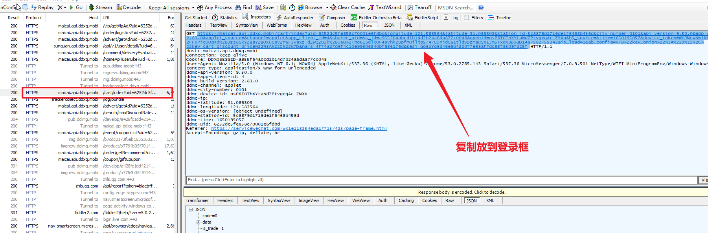

## 叮咚助手
## 申明
最新版微信小程序已不采用传统 `XHR` 请求了，改为了把请求地址以及Body传给微信云端请求处理，所以本程序从`2022-04-29`不再可用，等待其他大佬分析安卓协议吧

### 预览
[Releases](https://github.com/Kerwin1202/DingDong/releases) 有现成编译好的 winx64 版本，可以直接下载食用。

### 登录
1. PC 登录微信，并打开小程序搜索 **叮咚买菜**
2. 下载 **Fiddler** 安装并打开, 配置 Https 抓包小程序购物车的地址
3. 
